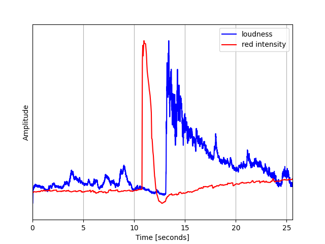
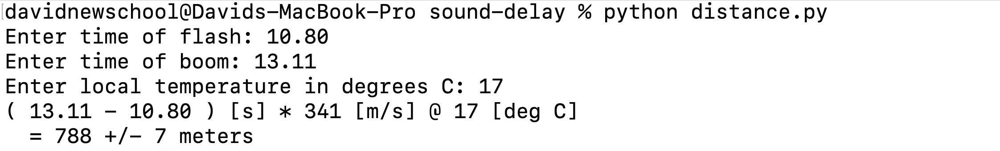

# sound-delay


## Background

**sound-delay** is a tool for estimating the distance of an explosion in a video from the point of view of the observer. Assuming that the light from the flash arrives at the observer almost instantaneously, the distance can be estimated by multiplying the time delay of the boom and flash of the explosion by the speed of sound. The use case is that you can geolocate an explosion with only one geolocated point of view (POV), while normally at least two POVs are required to triangulate the position of an event.

## Instructions

Note: the example video in these instructions is contained in the ```example/``` sub-directory.

https://github.com/davidnewschool/sound-delay/assets/125666415/05fd6358-642a-4833-ae3b-7f83175ab1d2

First, install the required libraries:

```pip install -r requirements.txt```

Next, download the video you wish to process. If you have the ffmpeg library installed, then the audio can be extracted automatically by the code. If not, you need to manually extract the audio into a separate ```.wav``` file. This can be done easily with a free application like Audacity: 


Now run the plotting script with the following command:

```python plot_delay.py```

Enter the path of the video file (and the audio file if manually extracted) into the prompt and press enter. Note, the audio can take a while to process, so it's recommended that you first crop your video to the relevant segment to minimize this processing time. 


A time series plot will appear displaying the audio and video signals: 


Zoom in to the abrupt increase in loudness, associated with the boom of the explosion, and then zoom in to the increase in red intensity, associated with the flash. The vertical grid lines and time-axis tick marks will give an indication of these times. Alternatively, place your mouse cursor on these points, and the time in seconds will appear on the bottom right of the plot as "x=...". Given a typical video frame rate of 25 frames/second, the arrival times need only be estimated to two decimal places. For such a frame rate, it is best to estimate the flash time from the first elevated value of the red intensity, rather than the value just before it, like as follows:


In contrast to the flash, due to the relatively high sample rate of most audio, the time of the explosion's boom should be estimated from the value immediately before the elevated loudness as follows:


Now run the second script with the following command:

```python distance.py```

You will be prompted for the times of the flash and sound of the explosion and the local air temperature in degree Celsius. Upon pressing enter, the estimated distance and error bounds will appear in the terminal:



Note: For each second of time delay, a 10 degree Celsius temperature difference yields a 6 meter difference in distance. This may not be significant for many geolocation applications.

## Optional Instructions

If the redness signal is noisy, crop the pixels of the video to only include the region of interest containing the explosion. You can use a program like iMovie if you are a Mac user for example.


The error estimate is measured using the frame rate of the video. Its default is 25 frames/second, yielding an error of about 7 meters, which is probably not significant for most geolocation applications. You can change it by opening the distance.py script with a text editor and entering it where the  ```frame_rate``` variable is assigned. The ```plot_delay.py``` script outputs the frame rate to the terminal for later use in the ```distance.py`` script.

## Miscellaneous

The concept of this tool is based on the explanation of @Dmojavensis on Twitter who wrote his own custom script (I believe in Matlab?). Give him a follow, he's a very talented geolocator. https://twitter.com/Dmojavensis/status/1696691599781290239

## Contact

For questions or suggestions, contact me on Twitter @davidnewschool
